<!-- HELO from the other side! -->

<a href="https://iconoir.com">
  <picture>
    <source media="(prefers-color-scheme: dark)" srcset="./data/peace-hand-dark.svg">
    
  </picture>
</a>

# Welcome to my GitHub profile!

[&logo=data:image/png;base64,iVBORw0KGgoAAAANSUhEUgAAACAAAAAgCAAAAABWESUoAAAAAW9yTlQBz6J3mgAAAQpJREFUOMuFksGRAjEMBFsXifwjPIgAyIAQSIMoePK8zWTuIdmWt7Y415Zsy1rNSCP4Zxn6/v4TezMza8cxkryfXfsVAUu0dAW4lgDPl0zhNRsg5Y+K04qHoVJJ3AbeqELVlVR+C68Void3CskR4NIolsEBSzwQ2CA0OTiYmYEDbPG+Lb3xWnlSKBCLakdlQjMIsS6z7xeACGgbwHYkpyV/xVdAVOahBX2nxY2yRaO86+RhIM5VzW7WaAWWS95tujUSM4dgCOF96yPXZUzJ3gDvVCz7wGkUAS+eT17LnMJHMwXcbvOMxtN0Sh2Dg0bdecBjYux+leAsnTv7nKgugnY2tJgTgJVbcX9bf3OTN7JOWfWeAAAAAElFTkSuQmCC&color=008DD5)](https://c.xkcd.com/random/comic/)

Hi! I'm **Pascal**, a `/(System Engineer|DevOps|Developer)/` from Bern 🇨🇭.  
I love to contribute to open source projects in my free time and occasionally design, realize and publish my own stuff.

<!-- references:start -->

<strong>✨ Some of my own projects...</strong>

<ul>
<table><tr><td width="500px">

<a href="https://github.com/paescuj">paescuj</a> / <a href="https://github.com/paescuj/jaa"><b>jaa</b></a>

> Job Application Assistant - Keep track of your ongoing job applications and impress your future employer with a unique way of applying

</td></tr></table>
<!-- references:end -->

<h2></h2>

<a href="https://github.com/anuraghazra/github-readme-stats">
  <picture>
    <source media="(prefers-color-scheme: dark)" srcset="./data/stats-dark.svg">
    
  </picture>
</a>
